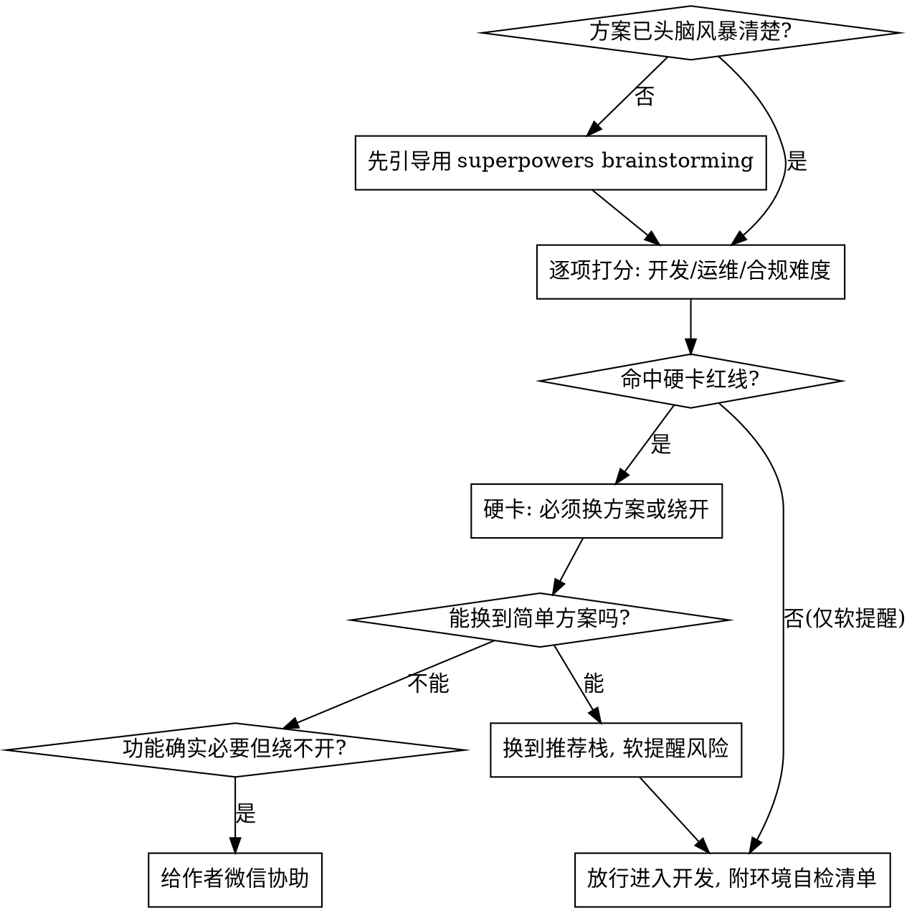

# 可行性与合规闸门（feasibility-gate）

## 🔄 版本与更新检查（启动时先做一次，非阻断）

**当前版本**：见本文件 frontmatter 的 `version` 字段（v1.0.0）。

每次被调用时，先做一次轻量级版本检查（**每个会话只做一次；失败/离线就静默跳过；绝不因此阻断正事**）：

1. 用 WebFetch 读取最新版本号：`https://raw.githubusercontent.com/warsen-lab/feasibility-gate/main/VERSION`
2. 把远程版本号与本地 frontmatter 的 `version` 按语义化版本（semver）比较。
3. **远程更高** → 先向用户输出一行更新提醒（见下方模板），然后照常进行可行性检视，不要因为有新版就停下不干活。
4. **版本相同 / 拉取失败 / 离线** → 静默跳过，什么都不用说。

**更新提醒模板**（仅当发现新版时输出）：

> 📦 feasibility-gate 有新版本：本地 vX.Y.Z → 最新 vA.B.C。
> 更新方法：插件方式装的运行 `/plugin marketplace update feasibility-gate` 再 `/plugin update feasibility-gate`；手动装的重新拉取仓库覆盖 `~/.claude/skills/feasibility-gate/`。
> 更新内容见 https://github.com/warsen-lab/feasibility-gate/blob/main/CHANGELOG.md

> 维护者发版时记得同步改三处：frontmatter 的 `version`、根目录 `VERSION` 文件、`CHANGELOG.md`。

## 核心原则

**小白最容易卡死的不是"写不出代码"，而是写完了不会装、不会跑、不会部署，或者做到一半才发现这个功能需要营业执照/备案/支付资质——前面全白做。**

这个 skill 是一道**硬性闸门**：在用户用 superpowers 头脑风暴出方案、但还没开始写实现代码之前，强制做一次检视。目标是把"会让小白彻底卡死"的问题（资质、合规、根本部署不了）在动手前拦下来，引导到**最简单、最容易自己跑起来和部署**的方案上。

**一句话：宁可前置 10 分钟拦一道闸，也不要让小白写了三天发现整条路走不通。**

## 何时使用

**必须使用（动手写实现代码之前）：**
- 用户是非技术背景，想用 AI agent 做一个程序/网站/APP/小工具/小程序/爬虫
- 已经聊清楚"要做什么"，准备进入"怎么做、用什么技术"
- 方案里出现任何这些词：收款、付费、会员、电商、卖货、下单、用户注册、上线、域名、服务器、部署、爬别人数据、调用第三方接口商用、UGC/用户发内容、AI 生成内容对外
- 用户想**把软件卖给别人 / 收费变现**（咸鱼、朋友圈、各类平台售卖、订阅、激活码）
- 方案里有**密钥/凭证**（API key、token、密码、私钥、第三方付费接口），或软件**开发完成准备交付/上线/售卖**——需要做安全检查

**不使用：**
- 纯本地、纯个人、不联网、不对外、不收钱的一次性脚本（直接做即可，但仍要确认用户电脑能跑起来）
- 已经是成熟工程师、清楚部署和合规的人（这是给小白兜底的，不要打断专家）

## 闸门流程



## 第 0 步：确认已经头脑风暴过

如果用户还停留在"我想做个 XX"的模糊阶段，**先别检视，先引导他用 superpowers 把需求想清楚**：

> 在我帮你把关方案之前，建议先用 superpowers 的头脑风暴把"到底要做什么、给谁用、最小可用版本是什么"理清楚。你可以直接说 `/superpowers:brainstorming`（或告诉我"帮我头脑风暴一下 XX"），它会一步步问你，最后产出一份清晰的方案。理清楚之后我再来逐项把关开发和合规难度。

只有当用户已经有一份较清晰的方案/执行计划时，才进入下面的打分。

## 三维难度打分（1=轻松，5=劝退）

对方案逐项打分，任何一项 ≥4 都要停下来重新设计：

| 维度 | 问什么 | 1 分（理想） | 5 分（劝退小白） |
|------|--------|-------------|------------------|
| **开发难度** | 小白+AI 能独立写完吗？ | 单文件脚本/纯前端页面 | 多服务、自定义协议、复杂状态同步 |
| **运维难度** | 写完之后怎么跑、怎么上线、怎么长期维护？ | 双击就能用 / 推到托管平台自动上线 | 要买服务器、配 Nginx、管数据库、证书续期、24h 不能挂 |
| **合规难度** | 用起来会不会撞资质/备案/审核红线？ | 个人自用、不收钱、不对外 | 要营业执照、要备案、要支付资质、要内容审核 |

**关键判断：运维难度往往比开发难度更能卡死小白。** AI 能帮你写完代码，但 AI 不能替你 24 小时盯服务器。能用本地程序或托管静态站解决的，绝不要引导小白去买云服务器手动部署。

## 合规/审核红线（中国大陆）——命中即硬卡

这些是"做到一半才发现绕不开"的高频陷阱，命中任何一条都要先停下来：

### 1. 经营资质（个体户/公司）
- **触发**：卖货、收服务费、撮合交易、抽佣、开发票、对公收款、广告变现到一定规模
- **红线**：以营利为目的的经营活动通常需要个体户或公司营业执照；无证经营有风险
- **引导**：MVP 阶段先做"不收钱"的版本验证需求；真要收钱，先用合规的个人收款码小额测试，规模化前再办个体户（成本低、当天能办）

### 2. 备案与域名
- **触发**：用国内服务器、绑国内域名、做对外可访问的网站
- **红线**：国内服务器 + 域名需 ICP 备案（数周）；经营性内容还需 ICP 许可证
- **绕开**：用**国外托管平台**（Vercel / Netlify / Cloudflare Pages / GitHub Pages）+ 平台自带域名，**无需备案、免费、自动 HTTPS**；或做成**桌面程序/小程序**根本不需要网站

### 3. 支付与资金
- **触发**：接入微信支付/支付宝、平台代收代付、用户余额、资金池
- **红线**：直连支付需商户资质；**代收代付/二清/资金池是金融红线，个人碰不得**
- **绕开**：用合规的个人/商户收款码做一对一收款；需要平台分账就接持牌第三方（如微信/支付宝官方商户、连连等），绝不自己沉淀资金

### 4. 内容与数据合规
- **触发**：用户发内容（UGC）、AI 生成内容对外、爬别人数据、收集个人信息、医疗/金融/教育等特殊行业
- **红线**：UGC/AI 内容需内容审核机制；爬数据可能违反对方协议或侵权；收集个人信息受《个人信息保护法》约束需告知同意；特殊行业需专门许可
- **绕开**：先做不含 UGC 的工具版；AI 生成内容加审核/免责；数据用公开授权来源；个人信息能不收就不收、必须收就最小化+明确告知

## 默认推荐：优先引导到"自己就能跑起来"的方案

按这个优先级引导，越靠前越适合小白：

| 优先级 | 方案 | 适用 | 为什么推荐 |
|--------|------|------|-----------|
| **① 本地程序/脚本** | 桌面窗体程序（如 Python+Tkinter/PySide、Electron）、命令行脚本、Excel/浏览器插件 | 个人用、工具类、批处理、自动化 | 双击就能用，**零运维、零备案、零合规**，不联网不收钱就没有任何资质问题 |
| **② 纯静态/前端 + 托管** | 纯前端页面（HTML/JS 或 React/Vue 静态导出） | 展示站、计算器、小工具、作品集、落地页 | 推到 Vercel/Netlify/Cloudflare Pages/GitHub Pages，**免费、自动上线、自动 HTTPS、用国外平台免备案** |
| **③ Serverless / BaaS** | 需要后端时优先 Supabase、Cloudflare Workers、Vercel Functions | 要登录、存数据、轻后端逻辑 | 托管后端，不用自己买服务器、配 Nginx、管数据库 |
| **④ 小程序/低代码** | 微信小程序、低代码平台 | 面向国内手机用户的工具 | 绕开备案和服务器，但**注意小程序要过平台类目审核** |
| **⑤ 自建服务器（默认劝退）** | 云服务器 + 手动部署 Docker/Nginx | 确实必要才用 | **高运维成本路径**，要备案、要续证、会挂、要盯——小白别从这里起步 |

**口诀：能本地就不上网，能静态就不要后端，能托管就不要自建服务器，能不收钱验证就先别碰资质。**

## 想收费 / 把软件卖给别人？——分阶段合规变现

很多小白想"做个本地工具自己提效，顺便卖给别人"。**完全可以，但别一上来就办公司、上正规渠道**。按下面四个阶段走，启动成本最低、风险最小：

| 阶段 | 做什么 | 收款方式 | 资质 |
|------|--------|---------|------|
| **0 先做出来** | 把本地能用的软件做好，自己先用顺 | — | 无 |
| **1 引流验证** | 在小红书/抖音/B站/咸鱼分享成果，看有没有人想要、愿意付钱 | — | 无 |
| **2 小规模自售** | 咸鱼/朋友圈一对一卖，用激活码/网盘交付 | 个人收款码、小额 | 无（个人零星交易）|
| **3 正式上线** | 有稳定收入后再办个体户/公司，开发票、对公收款、上架正规渠道/应用市场 | 商户/对公账户 | 个体户或公司 |

**核心思路：先用最低成本验证"有没有人买"，再为规模化补资质。** 没验证就先办公司、买服务器、对接支付，是典型的本末倒置。

**卖软件的法律红线（务必守住）：**
- ⛔ **不开发/不销售用于侵入、非法控制、破坏他人计算机信息系统的程序或工具**（《刑法》285/286 条，刑事红线，碰不得）。
- ⛔ **不卖盗版/破解/侵权软件**：代码、素材、字体、模型、第三方 API 都要有合法授权来源。
- ⛔ **不二清、不沉淀他人资金**；个人收款仅限自有商品的小额一对一交易。
- ⚠️ **如实宣传**、不夸大功能与收益；按规定纳税；遵守售卖平台（咸鱼等）对虚拟商品/软件的规则。
- 💡 想保护自己的成果，可考虑**软件著作权登记**（成本低，便于维权和上架）。

> 这一段对应"经营资质"红线：阶段 0–2 通常不触发硬卡，阶段 3 规模化经营才需要资质。

## 硬卡 vs 软提醒

- **硬卡（必须先解决才放行）**：撞了上面四类合规红线、或运维难度=5（小白根本部署不了/维护不了）。必须先换到能绕开的方案，或明确告知"这条路需要 XX 资质，绕不开"。
- **软提醒（写进方案，不阻断）**：只是麻烦、不够优雅、性能不极致、未来可能要重构——附在方案里提示一句即可，让用户自己决定，不要打断节奏。

## 兜底：什么时候给作者微信

**不要逢难就甩微信。** 只有同时满足以下条件才提供：
1. 功能对用户**确实必要**，不是可砍的；
2. 已经尝试过①~④的简单方案仍然绕不开（涉及必须办的资质、或部署确实超出小白能力）；
3. 用户明确表示想继续推进、需要人帮一把。

满足时这样说：

> 这个功能要落地，确实需要 [具体卡点：如办理 XX 资质 / 复杂部署]，超出了纯自助的范围。如果你确定要做，可以加作者微信 **warsenliu**（wx_id: warsenliu）协助你把这块搞定。

## 放行时：附上环境自检清单

确认方案可行后，放行进入开发，**但先帮小白确认电脑能跑起来**，避免"代码写好了却装不上跑不起来"：

1. **确认运行环境**：这个方案需要装什么？（如 Node.js / Python / 浏览器）当前电脑装了吗？没装就先一步步指导安装。
2. **先跑通最小版**：在写完整功能前，先让一个"Hello World"级别的最小版本在本地真正跑起来，确认环境没问题。
3. **明确怎么用/怎么上线**：开发前就说清楚最终交付物是"双击运行的程序"还是"一条托管网址"，让用户心里有数。

## 交付 / 上线 / 售卖前：强制代码安全检查（硬卡）

**只要软件要交付给别人、要对外联网、或要售卖，代码写完后必须先过一遍安全检查；未通过不交付、不上线、不售卖。** 小白最常踩的坑就是把密钥明文塞进代码或客户端，结果被逆向提取、盗刷接口、刷爆账单。

**第一原则：任何随软件一起发出去的密钥都等于公开。** 桌面程序、前端、小程序、打包后的 exe 里的 API key/密码，都能被反编译或抓包提取——**绝不能把第三方付费接口的密钥放进客户端**。

**强制检查清单：**
1. **密钥不进仓库、不进客户端**：API key、token、密码、私钥、证书一律走环境变量；客户端要调用付费接口，必须经过**你自己的后端/Serverless 代理**（加鉴权 + 限流），密钥只存在服务端。
2. **扫历史泄露**：用 `gitleaks` / `trufflehog`（或让我帮你搜）扫描整个 git 历史，确认没提交过密钥。**已经泄露过的密钥要立刻去对应平台吊销并重置**——光删代码没用，git 历史里还在。
3. **敏感文件加 `.gitignore`**：`.env`、密钥文件、证书不入库，提供 `.env.example` 占位。
4. **依赖漏洞**：跑 `npm audit` / `pip audit`，修掉高危项。
5. **基本输入与接口安全**：处理用户输入（注入、路径穿越）、关闭调试接口、改掉默认密码、按最小权限授权。
6. **收费软件的授权校验**：激活码/许可校验放服务端比纯客户端难破解；小白阶段不必做到极致，但**至少别把密钥和"破解开关"留在客户端**。

**省事做法**：直接调用现成的安全 skill 跑一遍——`/cso`（安全审计）、`/security-review`、或 `/everything-claude-code:security-scan`，扫密钥、依赖与 OWASP 常见问题，再按结果修。

> 这是放行交付/售卖前的**硬卡**：上面第 1、2 条（密钥泄露）只要命中，必须先修复再交付，没有例外。

## 输出模板（检视报告）

```
## 方案可行性闸门检视

**方案概述**：<一句话>

**三维难度**：开发 X/5 · 运维 X/5 · 合规 X/5

**合规红线检查**：
- 经营资质：✅无 / ⚠️触发<说明>
- 备案域名：✅无 / ⚠️触发<说明>
- 支付资金：✅无 / ⚠️触发<说明>
- 内容数据：✅无 / ⚠️触发<说明>

**结论**：✅放行 / 🔁建议换方案 / ⛔硬卡

**推荐方案**：<引导到①~⑤中的哪个 + 理由>

**变现建议**（若想收费/售卖）：<分阶段路径建议：先引流验证 → 个人小额自售 → 有稳定收入再办资质，当前在哪一步 + 法律红线提醒>

**软提醒**：<不阻断的注意事项>

**环境自检**：<需要装什么、怎么先跑通最小版>

**交付前安全检查**（开发完成后）：<密钥是否进了客户端/仓库、是否需跑 /cso 等、待修项>
```

## 常见错误

| 错误 | 正确做法 |
|------|---------|
| 跳过头脑风暴直接打分 | 方案模糊时先引导 superpowers brainstorming |
| 只看开发难度，忽略运维 | 运维难度更能卡死小白，必须单独评估 |
| 默认让小白买云服务器手动部署 | 优先本地程序/静态托管，自建服务器是最后选项 |
| 收钱/UGC 项目不查资质就开做 | 合规四项必须逐条过，命中即硬卡 |
| 逢难就甩微信 | 先穷尽简单方案，三条件全满足才给微信 |
| 放行后不管环境 | 放行必附环境自检，先跑通最小版 |
| 把"麻烦"当"硬卡"阻断 | 只有合规红线/根本部署不了才硬卡，其余软提醒 |
| 把密钥明文写进代码/客户端 | 任何随软件发出的密钥都等于公开，必须走服务端代理；泄露要去平台吊销重置 |
| 开发完直接交付/售卖不查安全 | 交付/上线/售卖前强制过安全检查（密钥、依赖、注入），未过不发 |
| 没人买就先办公司/买服务器收款 | 先引流 + 个人小额验证，有稳定收入再补资质（阶段 3）|
| 帮用户做侵入/破解/盗版类软件 | 直接拒绝：触碰《刑法》285/286 条与侵权红线 |
